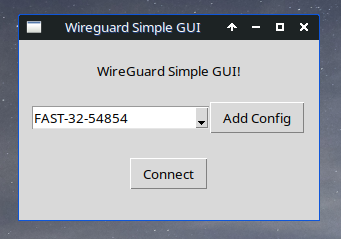

# WireGuard GUI
There is a simple WireGuard GUI to manage wireguard configs in linux as client



# Requirements
Install `wireguard` or `wireguard-tools` and `git` on your system
```bash
sudo apt install wireguard # Debian/Ubuntu
```
or
```bash
sudo dnf install wireguard-tools # Fedora
```
or
```bash
sudo pacman -S wireguard-tools # Arch
```
[other distros here](https://www.wireguard.com/install/)

# Installation
Clone project in your system (I imagine you have installed git). Then run `install.sh` script:
```bash
git clone https://github.com/mohammadali-arjomand/wg-gui.git
cd wg-gui
sudo ./install.sh
```
Now you can run WireGuard GUI by using `run-wg-gui`:
```bash
run-wg-gui
```

# License
MIT License, Copyright (c) 2025 MohammadAli Arjomand [more details](https://github.com/mohammadali-arjomand/wg-gui/blob/main/LICENSE)
